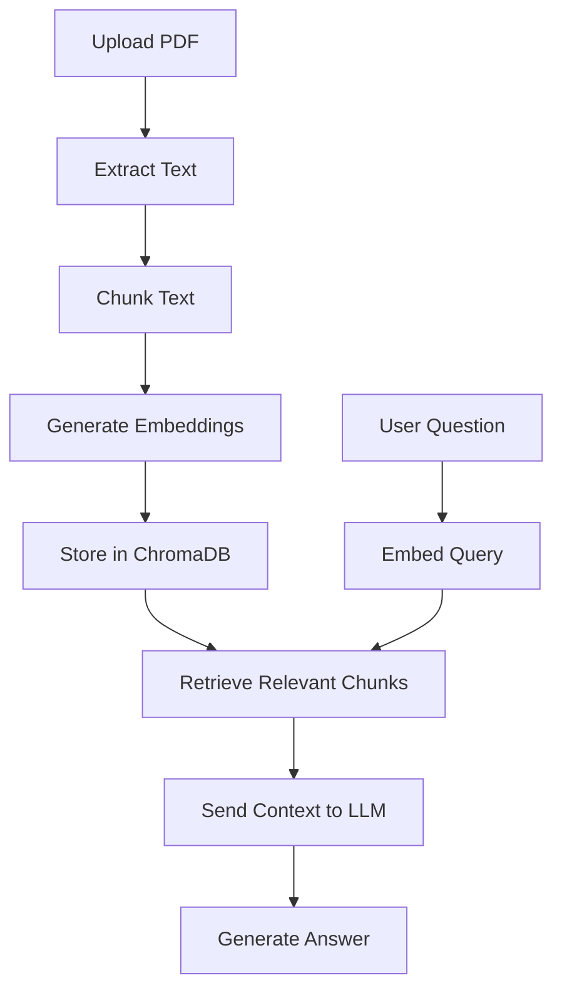

# PaperChat-AI: Research Paper Chatbot

*A local RAG-based system for understanding and querying research papers.*

This project is a **Research Paper Question-Answering Chatbot** that lets users upload any PDF research paper and ask questions about it. The system extracts text from the PDF, chunks the content, generates embeddings, stores them in a vector database, retrieves relevant parts using semantic search, and finally uses a **locally hosted LLM (Ollama)** to generate accurate answers.

Fully offline. Fast. Privacy-friendly.

---

## Features

* **Upload any research paper (PDF)**
* **Chunking + Embedding Generation** using BGE-base
* **Semantic Search** via ChromaDB
* **Local LLM Answering** using Ollama (Mistral model)
* **RAG Pipeline** (Retrieval-Augmented Generation)

---

## Architecture Overview

1. **PDF Parsing**
   Extract text from uploaded PDF using PyMuPDF.

2. **Text Chunking**
   Split text into 500-word segments for efficient retrieval.

3. **Embedding Generation**
   Convert chunks into embeddings using SentenceTransformers (`BAAI/bge-base-en-v1.5`).

4. **Vector Storage**
   Store chunks + embeddings in **ChromaDB**.

5. **Retrieval**
   For a given question, embed the query and fetch top relevant chunks.

6. **Answer Generation**
   Send retrieved context to a local LLM via **Ollama** (`mistral`) to produce the final answer.

---

## Tech Stack

| Area        | Technology                      |
| ----------- | ------------------------------- |
| UI          | Streamlit                       |
| PDF Parsing | PyMuPDF (fitz)                  |
| Embeddings  | SentenceTransformers (BGE-base) |
| Vector DB   | ChromaDB                        |
| LLM         | Ollama (Mistral)                |
| Backend     | Python                          |
| Deployment  | Fully local                     |

---

## Project Structure

```
📁 research-paper-chatbot
│── app.py
│── pdf_parser.py
│── chunker.py
│── embedder.py
│── db.py
│── qa.py
│── requirements.txt
└── README.md
```

---

## Installation

### 1️⃣ Clone the repository

```bash
git clone https://github.com/piyushdev04/PaperChat-AI.git
cd PaperChat-AI
```

### 2️⃣ Install dependencies

```bash
pip install -r requirements.txt
```

### 3️⃣ Install Ollama & Mistral model

* Download Ollama:
  [https://ollama.com/download](https://ollama.com/download)

* Pull the model:

```bash
ollama pull mistral
```

---

## ▶️ Run the App

```bash
streamlit run app.py
```

Open your browser at:

```
http://localhost:8501
```

---

## How It Works (RAG Pipeline)



---

## Example Usage

1. Upload any research paper PDF
2. Wait for processing (text extraction + indexing)
3. Ask questions like:

   * *“What problem does this paper solve?”*
   * *“Explain the methodology.”*
   * *“What are the main results?”*

The chatbot responds using grounded context from the paper.

---


## License

MIT License.

---